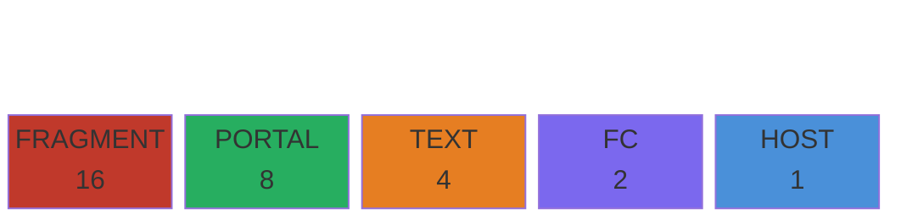
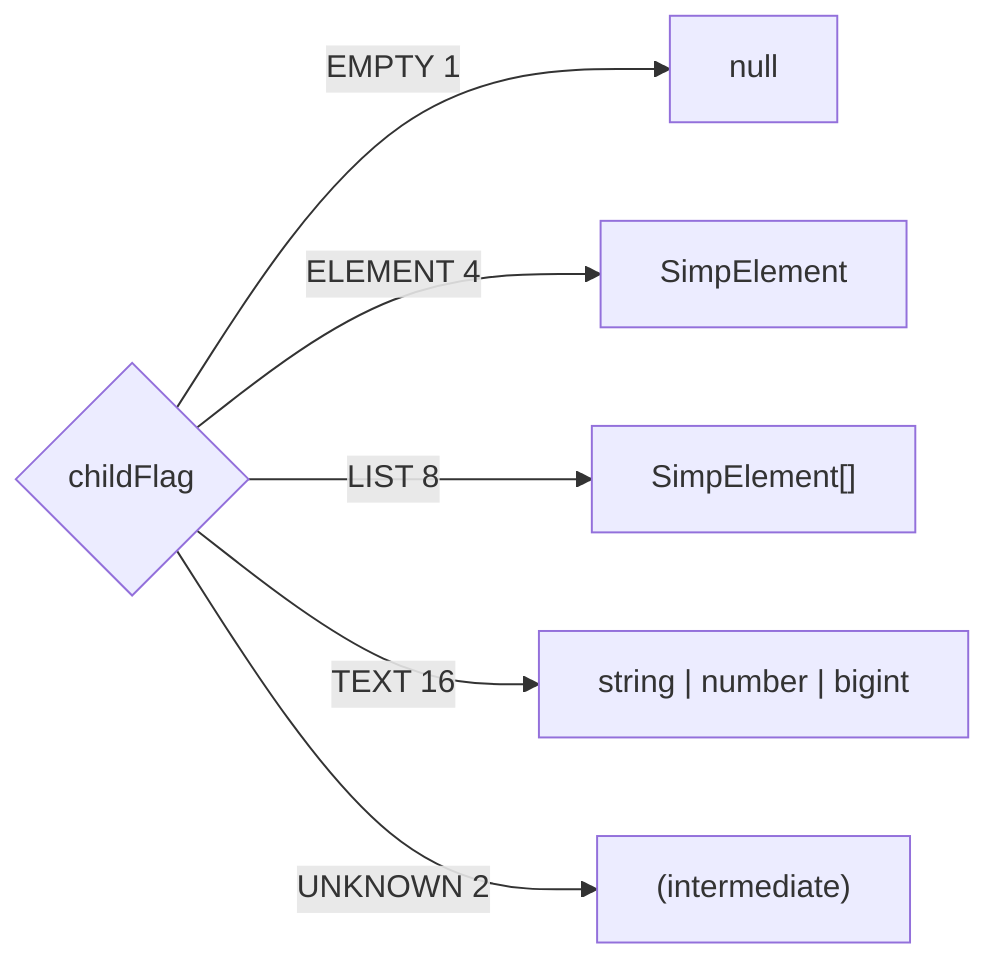
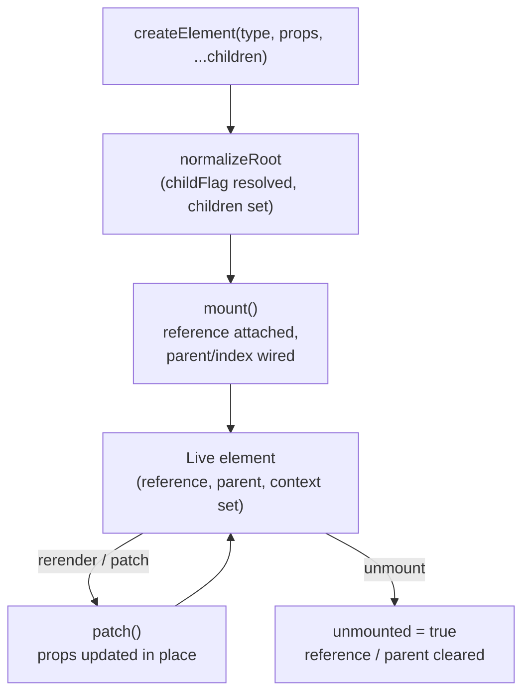

# Element Structure

Every node in a simpreact tree is represented as a `SimpElement`. The same object is created during JSX compilation and then mutated in place throughout its lifetime — there is no separate "fiber" vs "vnode" distinction.

## SimpElement fields

| Field | Type | Description |
|---|---|---|
| `flag` | `number` | Bitmask identifying the element type (HOST / FC / TEXT / PORTAL / FRAGMENT) |
| `childFlag` | `number` | Bitmask describing the shape of `children` (empty / single / list / text) |
| `type` | `string \| FC \| null` | Tag name for HOST, function reference for FC, `null` for TEXT |
| `props` | `any` | Props object passed by the caller; `null` for TEXT and FRAGMENT |
| `children` | `SimpNode` | Normalised child subtree after `normalizeRoot`; raw string for TEXT |
| `key` | `string \| null` | Reconciliation key (coerced to string from JSX `key` prop) |
| `parent` | `SimpElement \| null` | Pointer to the parent element; enables upward traversal |
| `index` | `number` | Position among siblings in a LIST; used for right-sibling lookup |
| `reference` | `unknown` | Host environment handle (e.g. DOM `Element` or `Text` node) |
| `className` | `string \| null` | Lifted out of props for fast diff; set when `props.className` is present |
| `ref` | `any` | Callback ref or ref object; also stores portal container on PORTAL elements |
| `context` | `any` | Context map (`Map<SimpContext, SimpContextEntry>`) propagated down the FC tree |
| `hostNamespace` | `string \| null` | SVG / MathML namespace inherited from the nearest HOST ancestor |
| `unmounted` | `boolean \| null` | Set to `true` after FC is torn down; guards against stale rerenders |

## Element type flags

Each element has exactly one type flag bit set. The bit position is used as a dispatch index into handler tables (via `bitScanForwardIndex`), which is why the values are powers of two with no gaps.

```
bit 0 (value  1)  HOST      — <div>, <span>, any DOM tag
bit 1 (value  2)  FC        — function component
bit 2 (value  4)  TEXT      — string / number / bigint leaf
bit 3 (value  8)  PORTAL    — createPortal(children, container)
bit 4 (value 16)  FRAGMENT  — <>...</>
```



Helper predicates in `flags.ts` test the bit directly:

```ts
isHost(el)     // (el.flag & 1)  !== 0
isFC(el)       // (el.flag & 2)  !== 0
isText(el)     // (el.flag & 4)  !== 0
isPortal(el)   // (el.flag & 8)  !== 0
isFragment(el) // (el.flag & 16) !== 0
```

## Child flags

`childFlag` describes the shape of the `children` field so the renderer never needs to inspect the value itself.

| Constant | Value | `children` shape |
|---|---|---|
| `EMPTY` | 1 | `null` / `undefined` / no renderable children |
| `UNKNOWN` | 2 | Not yet normalised (set transiently during `createElement`) |
| `ELEMENT` | 4 | A single `SimpElement` |
| `LIST` | 8 | `SimpElement[]` (keyed or un-keyed) |
| `TEXT` | 16 | A primitive text value (string / number / bigint) — HOST only |



## Lifecycle of an element object



TEXT elements are short-lived — they are re-created by `createElement` on every render and immediately replaced or discarded during reconciliation; they are never reused across renders.

FC elements are the opposite: the JSX element produced by the parent's render is a short-lived description that is immediately swapped for the long-lived `prevElement` object (`swapChildInParent` in `patching.ts`). The long-lived object accumulates state, context, and hooks across the entire component lifetime.
