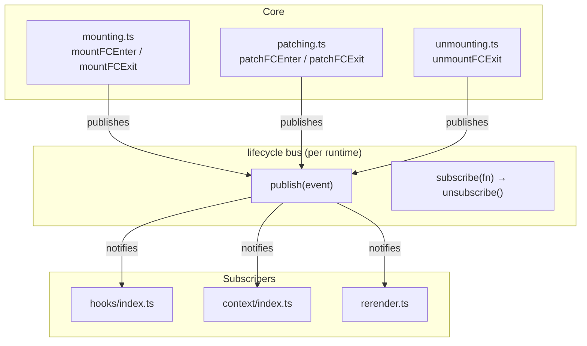
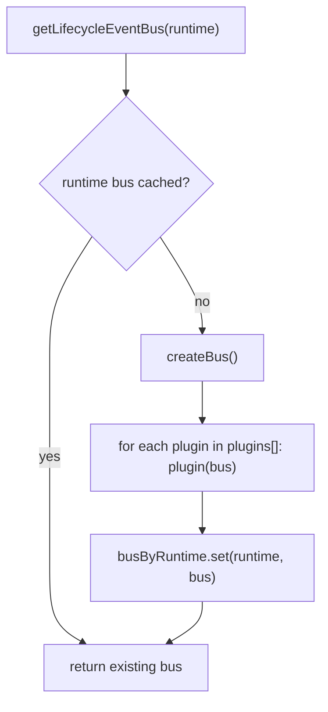
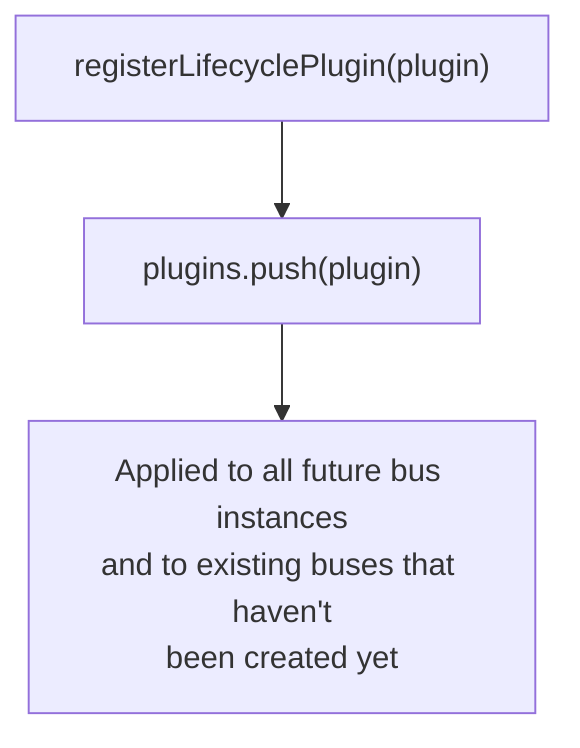
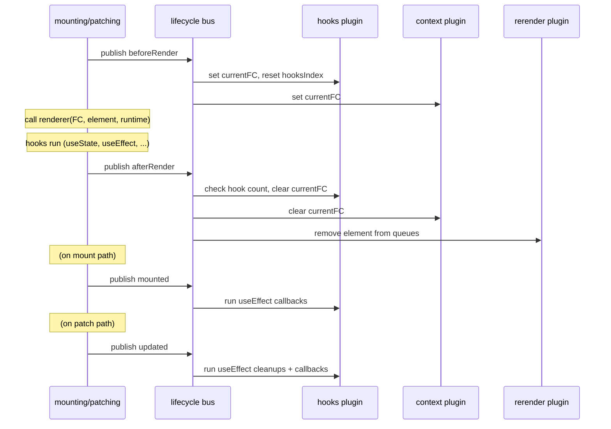
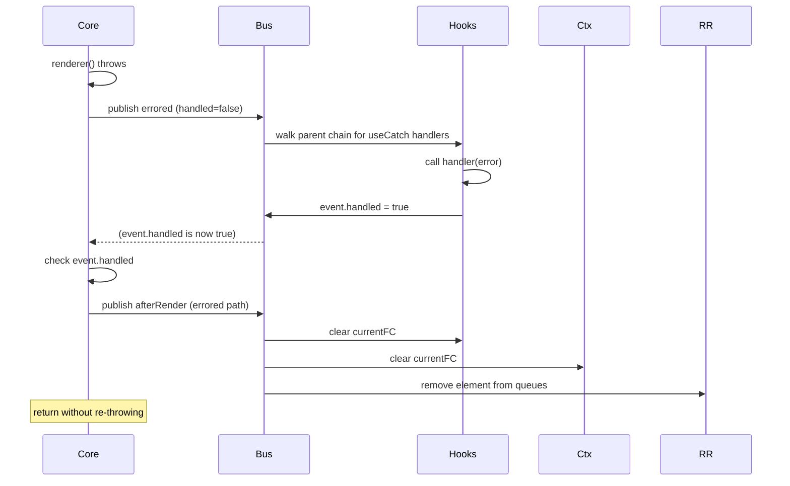
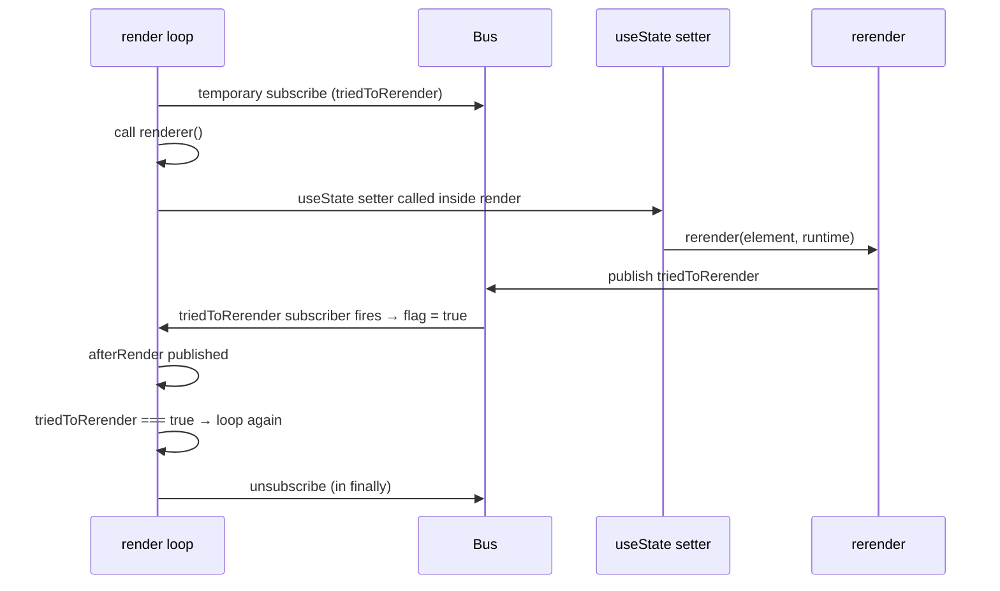

# Lifecycle Event Bus

The lifecycle bus is the integration layer between the core rendering engine and the feature modules (hooks, context, rerender scheduling). Core publishes events at well-defined points; feature modules subscribe to implement their behavior without touching the core rendering code.

## Architecture

## Bus per runtime

Each `SimpRenderRuntime` gets its own bus instance, created lazily on first access:

`plugins[]` is a module-level array populated by `registerLifecyclePlugin`. Any plugin registered before the first `getLifecycleEventBus` call for a given runtime is automatically applied when the bus is created.

## Plugin registration

Feature modules call `registerLifecyclePlugin` at module import time (top-level), so plugins are registered once when the module is first loaded. This is why importing `@simpreact/hooks` is sufficient to activate all hook lifecycle management — no explicit wiring is needed.

## Event types

| Event type | Publisher | Payload extras |
|---|---|---|
| `beforeRender` | `mountFCEnter`, `patchFCEnter` | — |
| `afterRender` | `mountFCEnter`, `patchFCEnter` | — |
| `triedToRerender` | `rerender()` | — |
| `mounted` | `mountFCExit` | — |
| `updated` | `patchFCExit` | — |
| `unmounted` | `unmountFCExit` | — |
| `errored` | `mountFCEnter` catch, `patchFCEnter` catch | `error: any`, `handled: boolean` |

All events carry `element: SimpElement` and `renderRuntime: SimpRenderRuntime`.

`errored.handled` is a mutable flag on the event object. A subscriber sets it to `true` to signal that the error was caught and the component should not crash. The first subscriber to claim it wins; core checks `event.handled` after publishing.

## Event timeline for an FC render

## Error handling flow

If no subscriber sets `event.handled = true`, core wraps the original error in a new `Error` with `{ cause }` and re-throws it, crashing the render.

## `triedToRerender` — in-render state update

This event is special: it is published by `rerender()` and consumed by the active render loop itself. `mountFCEnter` and `patchFCEnter` subscribe temporarily (for the duration of one FC's render) to detect whether `rerender` was called for the current element during its own render function. If so, the `do...while` loop re-runs.

The temporary subscription is unsubscribed in the `finally` block regardless of whether the render succeeded or threw.
