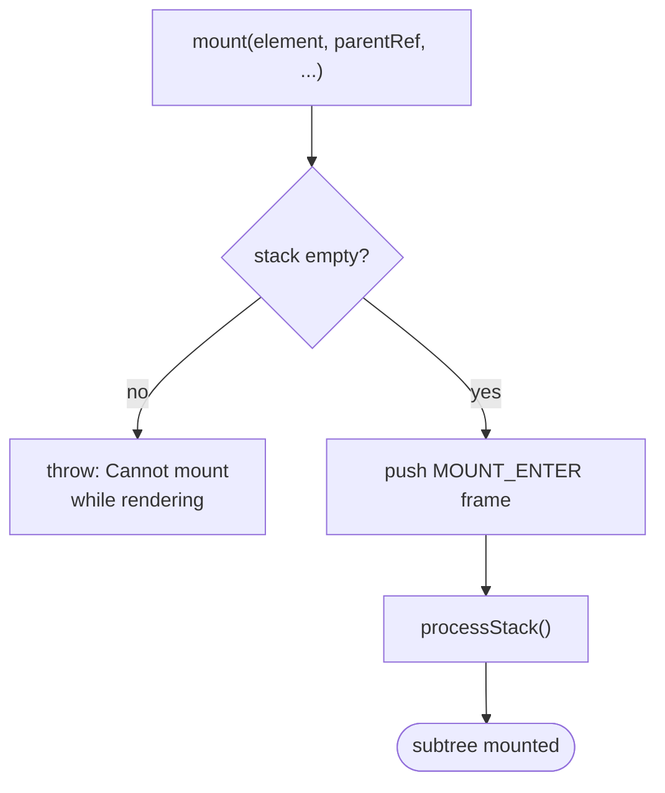
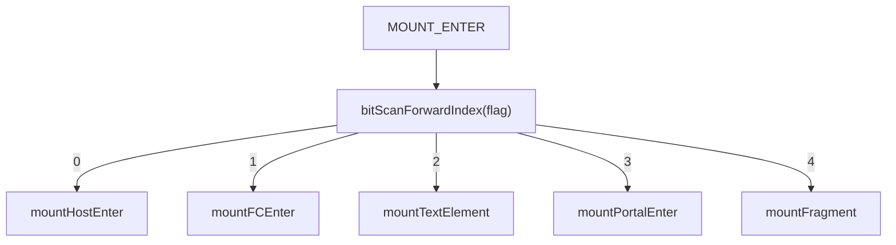
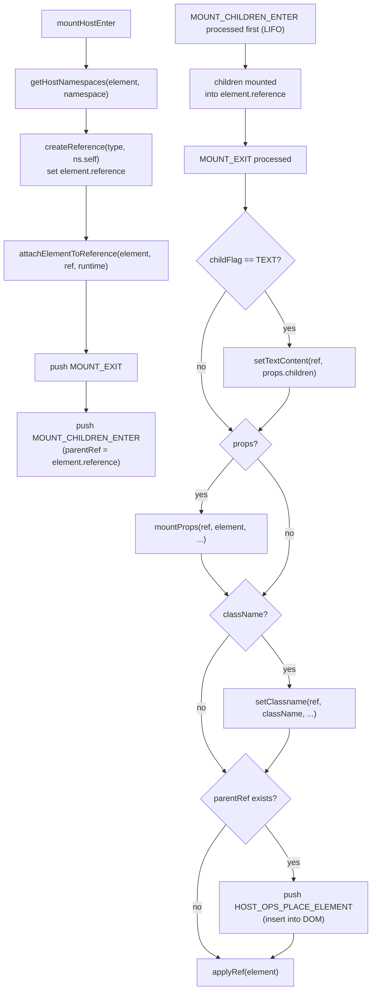
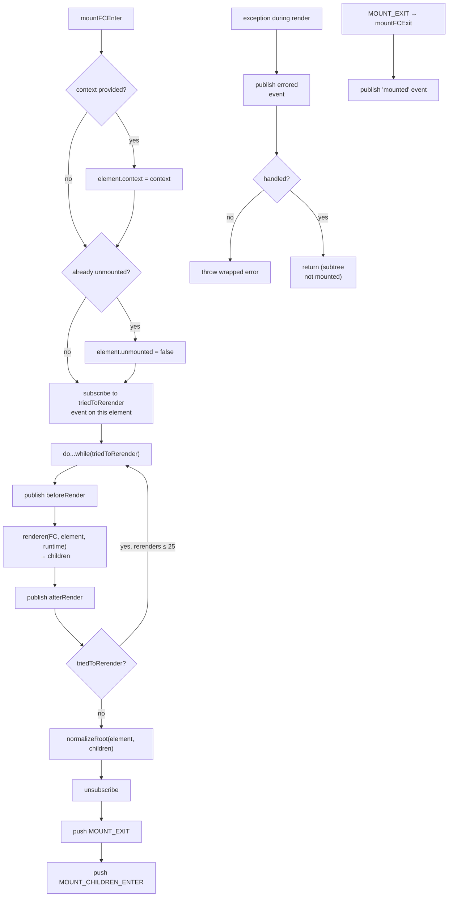
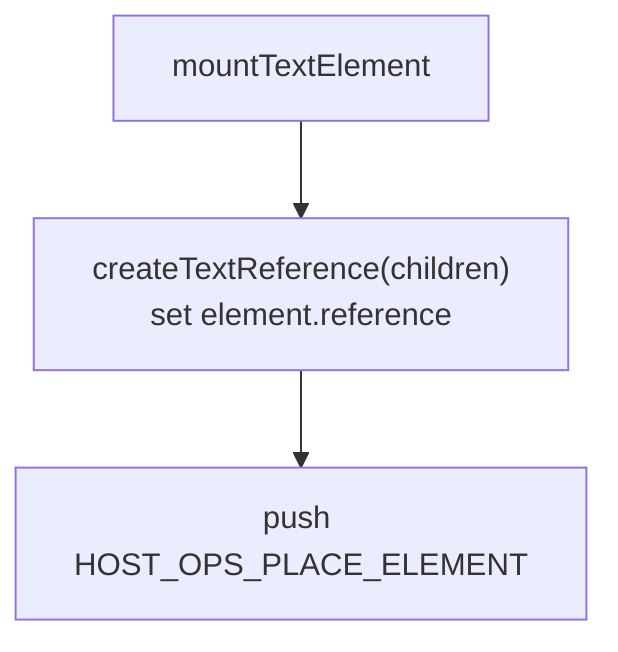
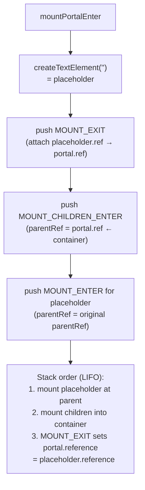
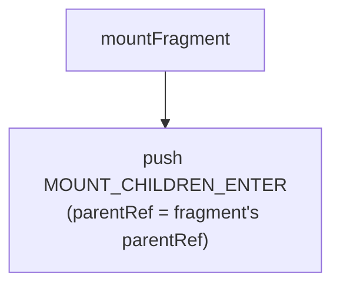
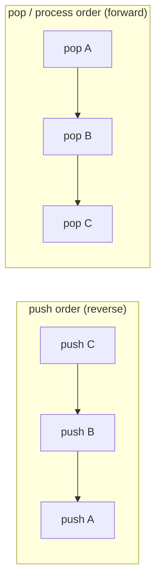

# Mounting

Mounting attaches a new element subtree to the host environment for the first time.

**Entry point:** `mount(element, parentReference, subtreeRightBoundary, context, hostNamespace, renderRuntime)`

The function asserts the render stack is empty, pushes one `MOUNT_ENTER` frame, then calls `processStack`. Every subsequent frame is pushed by the handlers themselves — mount is fully iterative.

## Top-level flow

## Per-type handlers (MOUNT_ENTER dispatch)

The `flag` field determines which handler runs. `bitScanForwardIndex(flag)` converts the single set bit into an array index `[HOST=0, FC=1, TEXT=2, PORTAL=3, FRAGMENT=4]`.

### HOST (`mountHostEnter`)

### FC (`mountFCEnter`)

The `triedToRerender` subscription catches state updates triggered during the render itself (e.g. `useState` setter called from a derived value). Up to 25 re-render loops are allowed before throwing.

### TEXT (`mountTextElement`)

TEXT elements have no EXIT frame — placement is the only post-creation operation.

### PORTAL (`mountPortalEnter`)

A portal renders its children into an external container while inserting an empty text placeholder node at the portal's logical position in the tree.

### FRAGMENT (`mountFragment`)

Fragments have no host reference. Children are mounted directly at the parent's position.

## Child ordering

`mountChildren` pushes child `MOUNT_ENTER` frames in **reverse order** so that when `processStack` pops them it processes them in forward (left-to-right) order. Each child also receives a `subtreeRightBoundary` pointing to its right sibling, which the eventual `HOST_OPS_PLACE_ELEMENT` uses to `insertBefore` the correct anchor.

