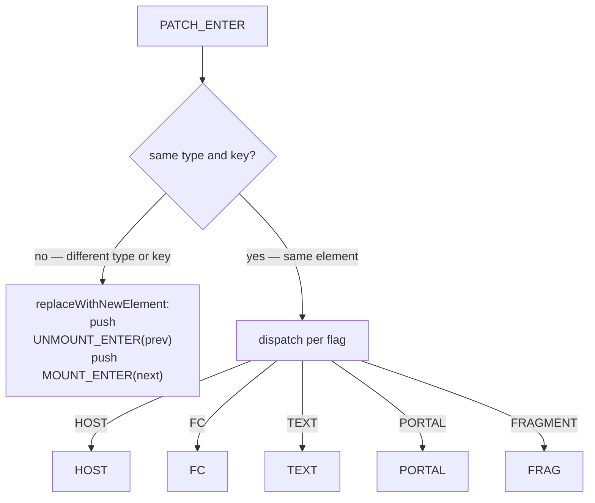
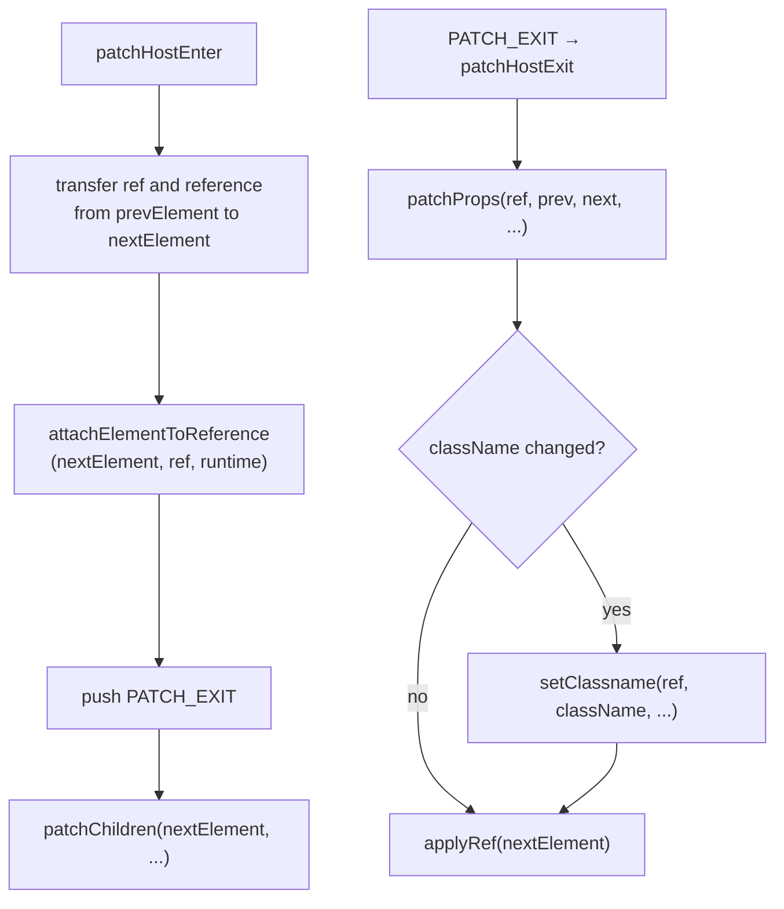
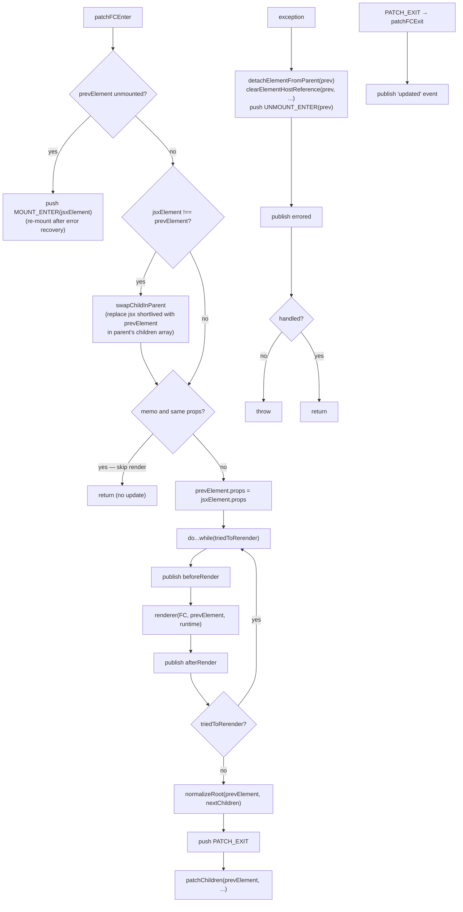
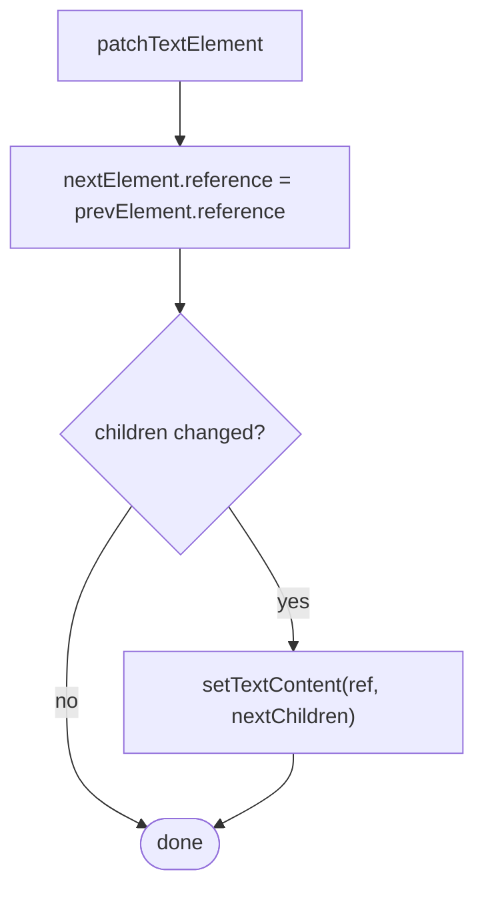
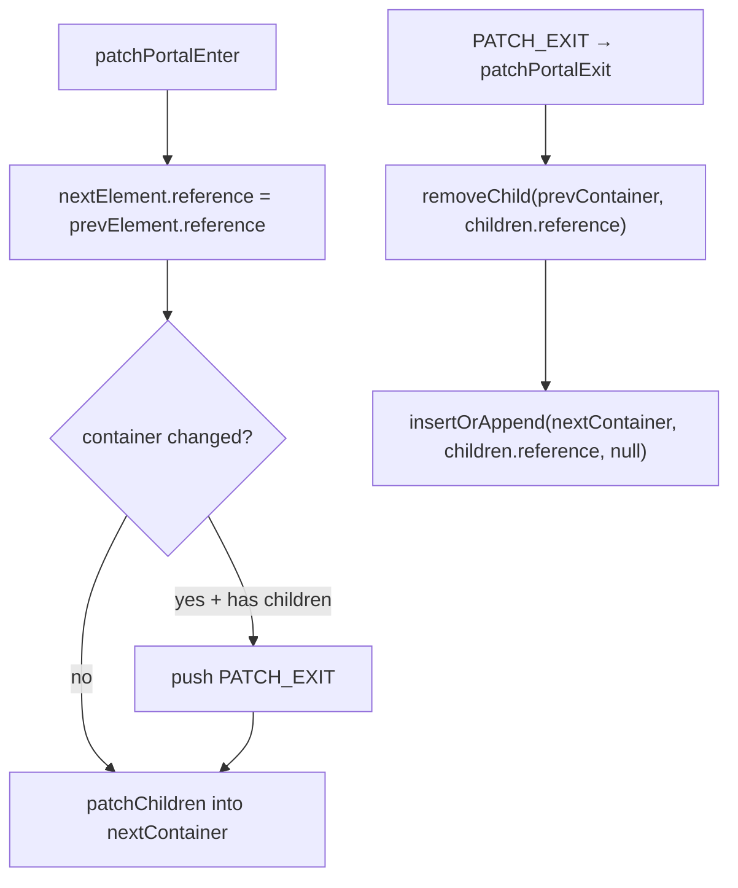
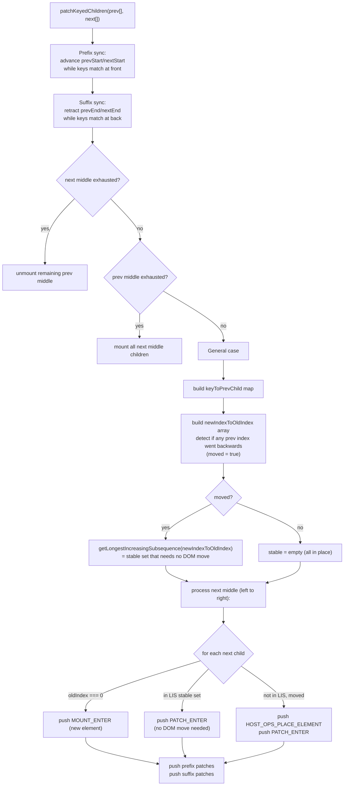

# Patching

Patching reconciles an existing element subtree against a new description, updating the host environment with the minimum set of changes.

**Entry point:** `patch(prevElement, nextElement, parentReference, subtreeRightBoundary, context, hostNamespace, renderRuntime)`

Asserts render stack is empty, pushes one `PATCH_ENTER` frame, then calls `processStack`.

## Top-level type/key check

The first thing `patchEnter` does is compare `prevElement.type` and `prevElement.key` against `nextElement`. A mismatch means the two elements represent entirely different trees — the old subtree is torn down and a new one is mounted.



For HOST-to-HOST replacement, a `HOST_OPS_REPLACE_CHILD` frame is pushed to atomically swap the DOM node before unmounting the old subtree.

## HOST (`patchHostEnter / patchHostExit`)



`patchChildren` is called synchronously inside `patchHostEnter` (not via the stack) because it needs to inspect `prevElement.children` before the frame is recycled. It pushes `PATCH_ENTER` / `MOUNT_ENTER` / `UNMOUNT_ENTER` frames for each child.

## FC (`patchFCEnter / patchFCExit`)



`jsxElement` is the short-lived element produced by the parent's render. After `swapChildInParent`, `prevElement` (the long-lived object) is used for all further work.

## TEXT (`patchTextElement`)



## PORTAL (`patchPortalEnter / patchPortalExit`)



## Children reconciliation

`patchChildren` handles all transitions between childFlag shapes (EMPTY ↔ ELEMENT ↔ LIST ↔ TEXT). Single-element and text transitions patch or mount/unmount straightforwardly. The interesting case is LIST ↔ LIST, which goes through the keyed reconciliation algorithm.

### Keyed children (LIST → LIST)

The algorithm minimises DOM moves while correctly handling arbitrary reorderings.



The LIS (Longest Increasing Subsequence) of the `newIndexToOldIndex` array identifies which children are already in the correct relative order and need no DOM move. Only the remaining children are repositioned.

## Patching from the middle of the tree

`rerender()` triggers a patch from an arbitrary FC element rather than from the root. It calls:

```ts
patch(element, element, findParentReferenceFromElement(element), null, element.context, element.hostNamespace, renderRuntime)
```

`prevElement === nextElement` — the element patches against itself. `patchFCEnter` detects this case (`jsxElement === prevElement`, so `swapChildInParent` is skipped and the memo check is bypassed since self-rerenders always proceed). The rest of the flow is identical to a root patch.
