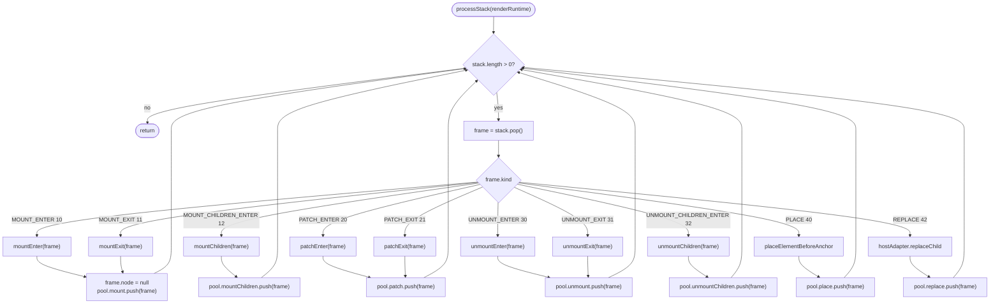
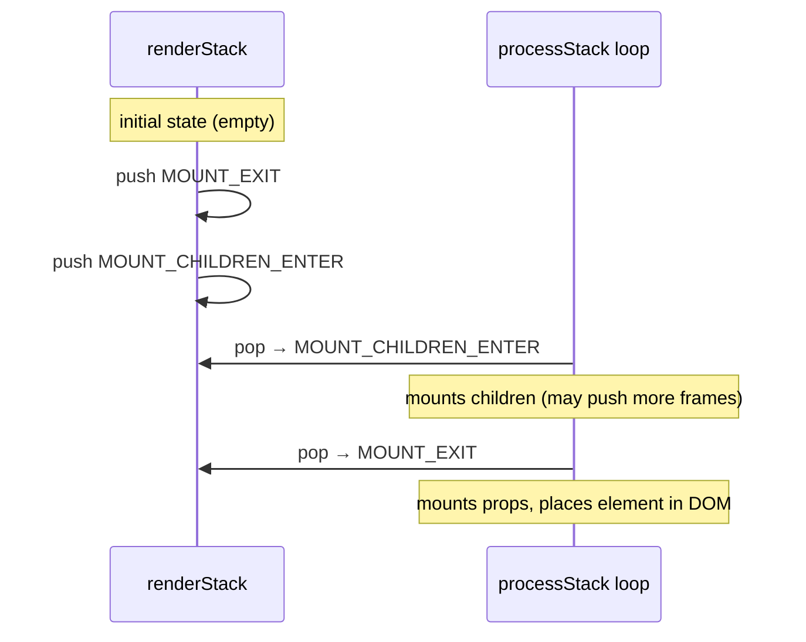
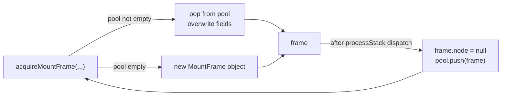

# Process Stack

The rendering engine is **iterative, not recursive**. Work is described as typed frames pushed onto `renderRuntime.renderStack` (a plain `SimpRenderFrame[]`). A single `processStack` loop pops and dispatches them until the stack is empty.

This avoids JavaScript call-stack overflows for deep trees and makes it straightforward to interleave mount, patch, unmount, and DOM placement operations on the same pass.

## Frame types

| Kind constant | Value | Handler |
|---|---|---|
| `MOUNT_ENTER` | 10 | `mountEnter(frame)` |
| `MOUNT_EXIT` | 11 | `mountExit(frame)` |
| `MOUNT_CHILDREN_ENTER` | 12 | `mountChildren(frame)` |
| `PATCH_ENTER` | 20 | `patchEnter(frame)` |
| `PATCH_EXIT` | 21 | `patchExit(frame)` |
| `UNMOUNT_ENTER` | 30 | `unmountEnter(frame)` |
| `UNMOUNT_EXIT` | 31 | `unmountExit(frame)` |
| `UNMOUNT_CHILDREN_ENTER` | 32 | `unmountChildren(frame)` |
| `HOST_OPS_PLACE_ELEMENT_BEFORE_ANCHOR` | 40 | `placeElementBeforeAnchor` |
| `HOST_OPS_REPLACE_CHILD` | 42 | `hostAdapter.replaceChild` |

## The main loop

## ENTER / EXIT pairs

Most element types use an enter/exit pair to bracket work that must happen before and after children are processed. The stack is LIFO, so pushing EXIT before CHILDREN means CHILDREN is processed first:

This pattern is used identically by HOST, FC, PORTAL, and FRAGMENT elements for mount and unmount. Patch uses PATCH_ENTER / PATCH_EXIT the same way.

## Frame pool

Frame objects are expensive to GC at high frequency. `processStack` recycles every frame after use: it nulls `frame.node` (to release the element reference) and returns the frame to a per-runtime pool keyed by `WeakMap<SimpRenderRuntime, FramePool>`.

`acquire*Frame` functions are the only constructors for frames. Handlers never create frame objects directly.

## Reentrancy guard

`mount()`, `patch()`, and `unmount()` all assert `renderStack.length === 0` before pushing their initial frame. This prevents concurrent entry into `processStack` from the same runtime, which would produce undefined behavior (two interleaved stack walks over the same array).
