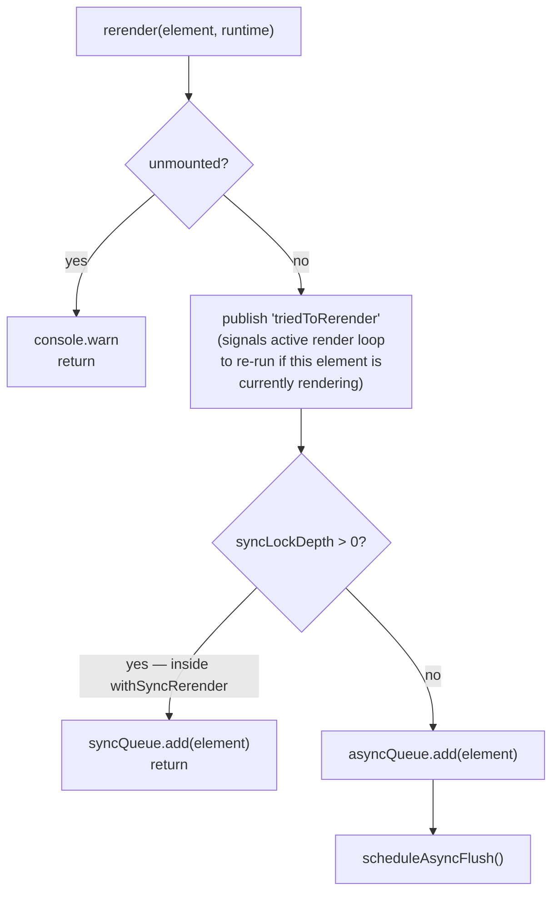
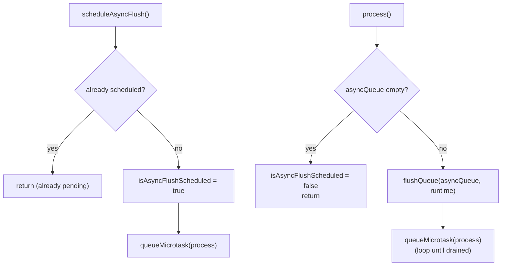
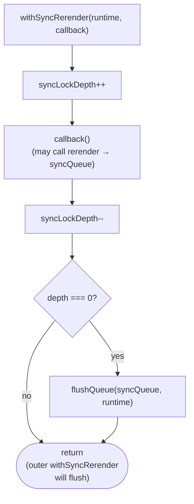
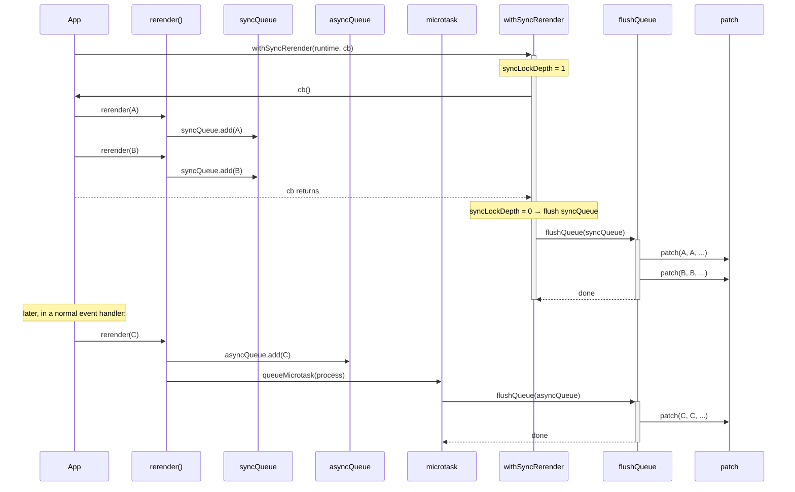
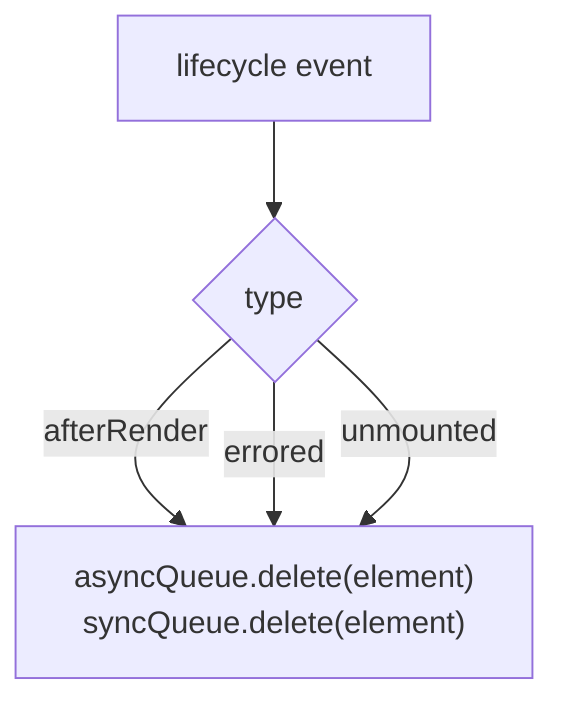

# Rerender

A rerender is a self-triggered patch: a mounted FC element signals that its internal state changed and it should re-run its render function. The core mechanism is `rerender(element, renderRuntime)`, which schedules (or immediately flushes) a call to `patch(element, element, ...)`.

All rerender state is stored in a per-runtime `WeakMap<SimpRenderRuntime, RerenderSpecificData>`:

```ts
interface RerenderSpecificData {
  syncQueue:            Set<SimpElement>;  // flush synchronously when sync lock drops to 0
  asyncQueue:           Set<SimpElement>;  // flush via queueMicrotask
  syncLockDepth:        number;            // nesting depth of withSyncRerender calls
  isAsyncFlushScheduled: boolean;          // dedup microtask scheduling
}
```

## `rerender(element, renderRuntime)`



### triedToRerender and render-time state updates

When `rerender` is called during the render of the same element (e.g. a state setter called from inside a render function), the `triedToRerender` event fires. The active `do...while` loop in `mountFCEnter` / `patchFCEnter` is subscribed to this event and sets a flag that causes the loop to re-run immediately after `afterRender`. This handles the case without queuing.

## Async flush



Multiple `rerender` calls for different elements that arrive in the same synchronous turn are all added to `asyncQueue` before any microtask runs. `flushQueue` processes the entire set in one pass, then re-schedules itself in case the flush produced further rerenders.

## `withSyncRerender(renderRuntime, callback)`

`withSyncRerender` is used to batch state updates that must be applied synchronously — typically event handlers where you want all downstream patches to complete before returning to the caller.



`withSyncRerender` calls can nest. Each level increments the lock depth. Only the outermost exit (depth goes 1→0) flushes the sync queue.

### Interaction between sync and async queues



## `performRerender(element, renderRuntime)`

The actual work is a self-patch:

```ts
patch(
  element,                                   // prevElement = element itself
  element,                                   // nextElement = element itself
  findParentReferenceFromElement(element),   // walk parent chain to find host ref
  null,                                      // no subtree right boundary
  element.context || null,
  element.hostNamespace,
  renderRuntime
)
```

`patchFCEnter` sees `jsxElement === prevElement` and skips `swapChildInParent` and the memo check, proceeding directly to re-rendering.

## Queue cleanup

When an element finishes rendering or is unmounted, it is removed from both queues so stale entries never reach `performRerender`:


