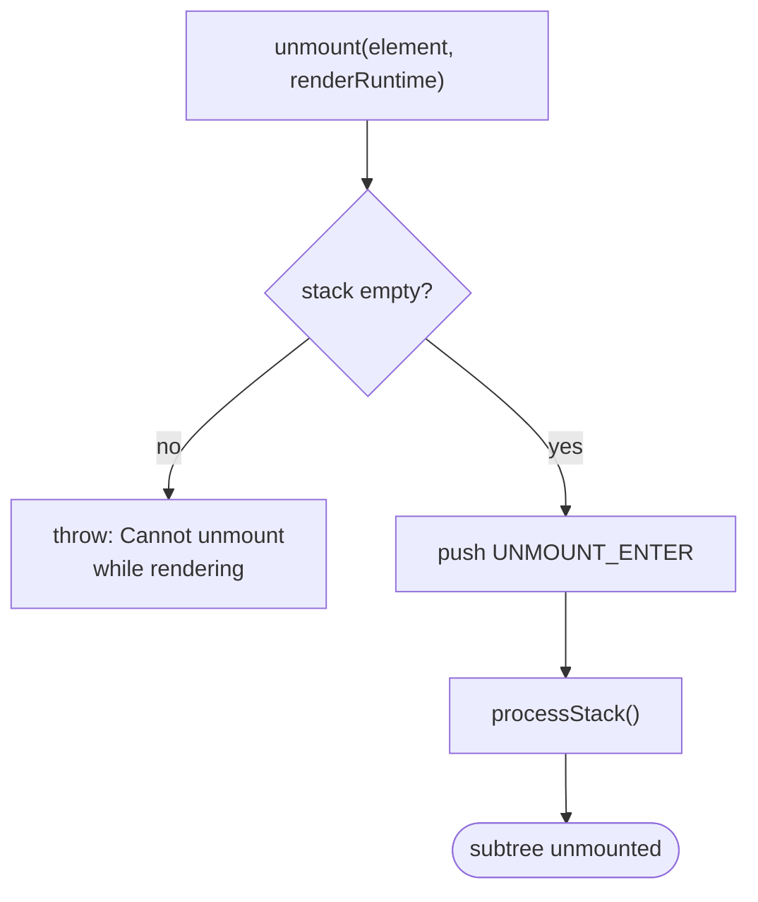
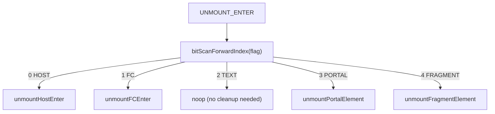
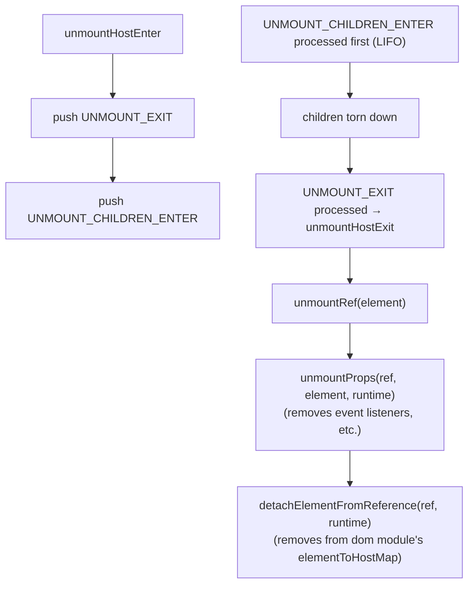
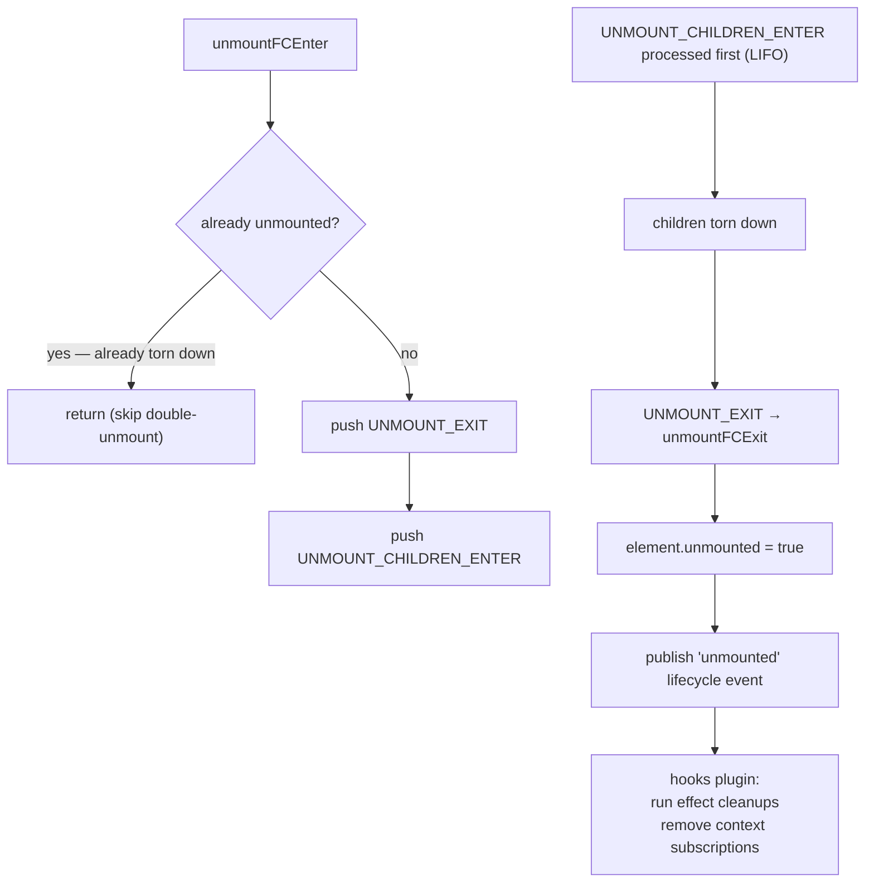
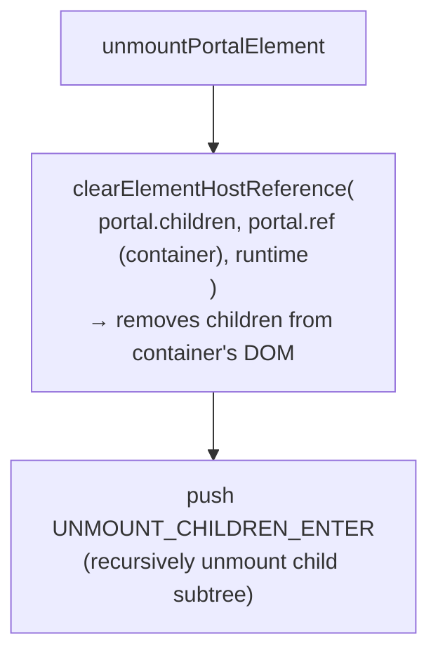
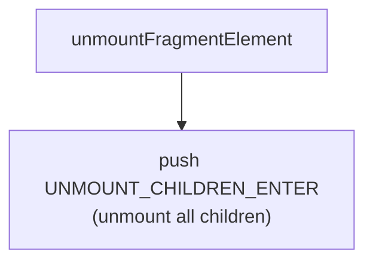
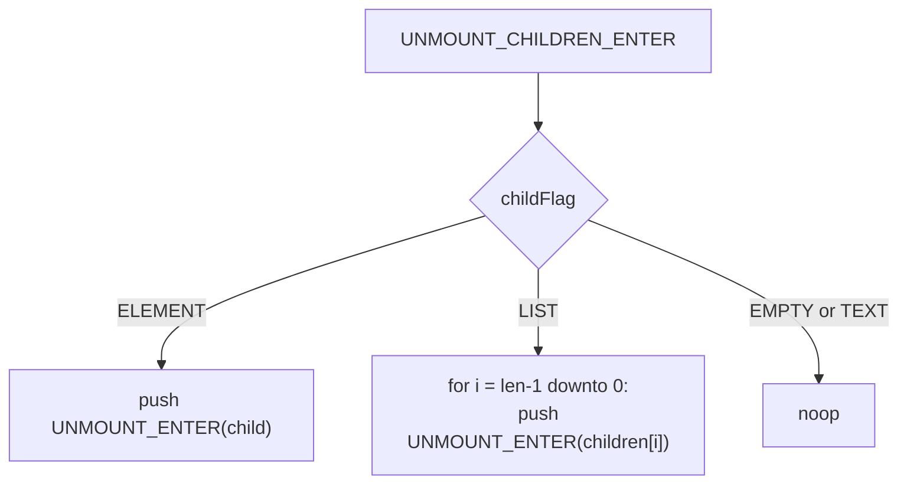
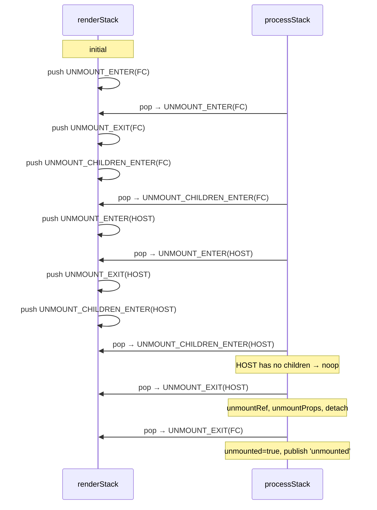

# Unmounting

Unmounting tears down an element subtree and releases all associated host resources.

**Entry point:** `unmount(element, renderRuntime)`

Asserts render stack is empty, pushes one `UNMOUNT_ENTER` frame, then calls `processStack`.

## Top-level flow

## Per-type dispatch (UNMOUNT_ENTER)

TEXT elements carry no host state that requires cleanup — the text node is removed by the parent HOST element's DOM removal.

## HOST

Note: `unmountHostExit` does **not** remove the DOM node from the document. The caller is responsible for DOM removal (typically via `hostAdapter.removeChild` triggered by the parent's reconciliation). Unmounting only releases resource ownership (event listeners, element maps, refs).

## FC

The `unmounted = true` flag on the element object guards against stale `rerender()` calls (e.g. from a `useEffect` cleanup that fires after unmount).

## PORTAL

Portals remove their children from the remote container before recursing, so the subtree is visually gone before the FC `unmounted` events fire.

## FRAGMENT

Fragments have no host reference of their own; they only propagate the unmount to their children.

## Children teardown order

`unmountChildren` pushes child `UNMOUNT_ENTER` frames in **reverse order**, so `processStack` processes them front-to-back. This is the natural teardown order (first child unmounted first), matching mounting order.

## Full sequence for a single FC with a HOST child

